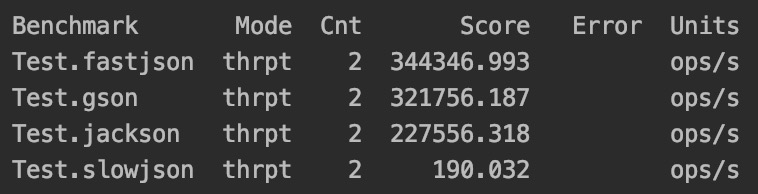

> 你想升职加薪吗？  
> 你想拿年终奖吗？  
> 你想成为同事眼中的性能优化小能手吗？   
> 今天用slowjson，年底做性能优化换回fastjson，十倍性能不是梦，升职加薪准能成。   
更详细内容可以参考博文[Antlr4实战之JSON解析器slowjson](https://blog.csdn.net/xindoo/article/details/104735750)    

### 性能对比

没错，性能差就是slowjson的优势，如有需要可以自行修改随机自旋的参数，以实现更差的性能。。  

### Todo
1. 上传至maven中心仓库，方便大家冲KPI，嘿嘿嘿。 
2. 完善API，虽然抄了fastjson的api，但确实没抄全。 
3. 完善类型，json规范里其实是支持null, boolean, 数字类型的，我这图简单都用了String类型。 
4. 完善Excption，目前如果抛Exception都是抛的antlr的，会对用户有误导作用。
5. 增加控制随机自旋的API，性能控制交于用户。  

实际上列Todo是为了让slowjson看起来像个项目，至于做不做就随缘了，毕竟不完美才是slowjson最大的特点。。。。

